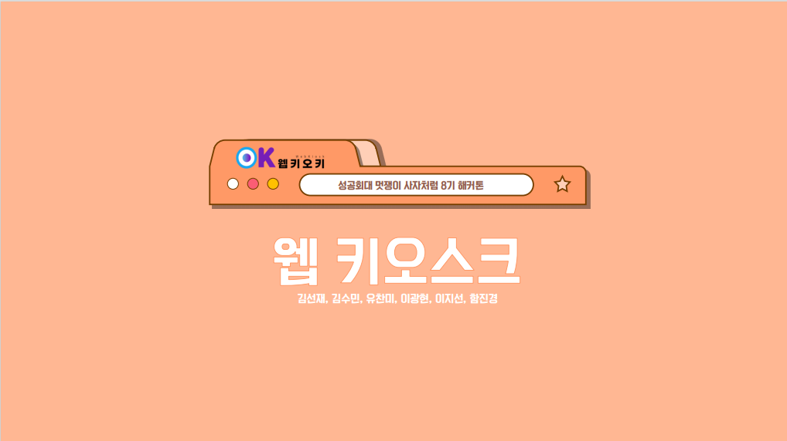
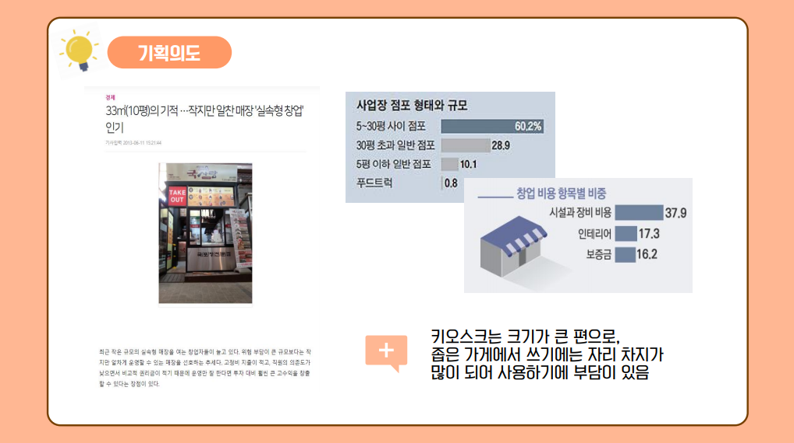
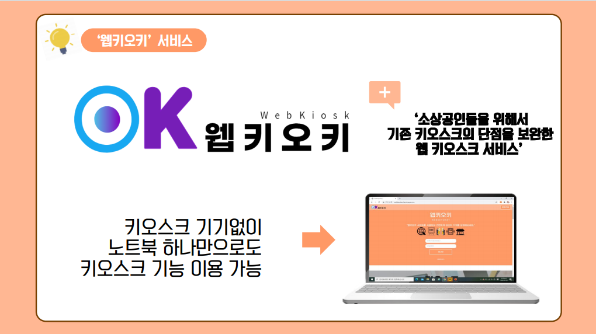
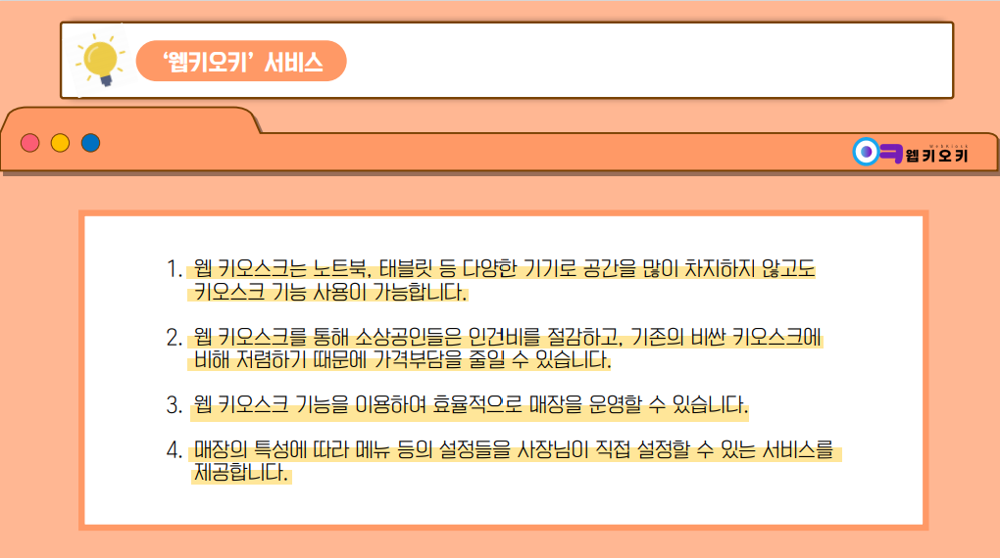
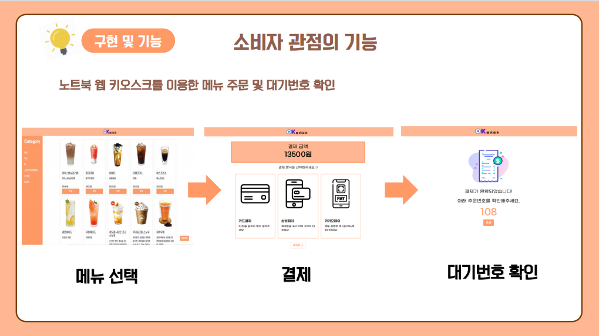
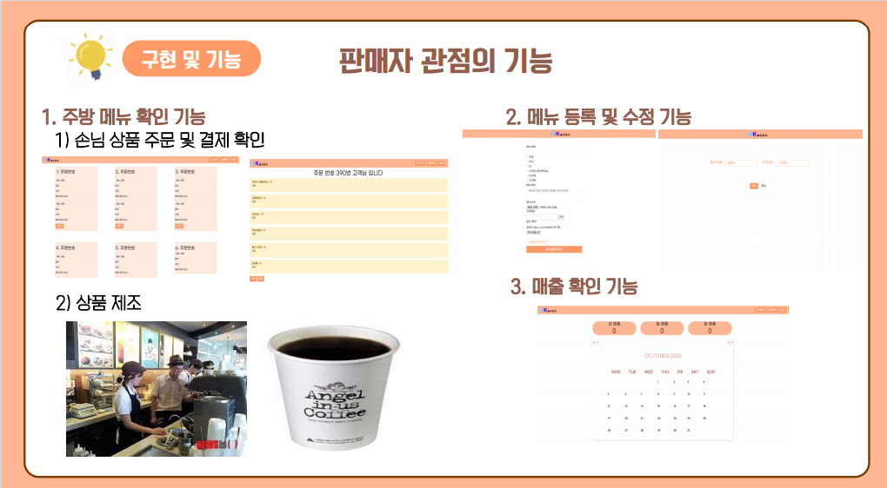

# WebKeyOKey(웹키오키)

웹키오스크 서비스를 제공하는 '웹 + 키오스크 = 웹키오키(WEBKEYOKEY)'

편리한 키오스크, 사용하고 싶지만...
비싸고, 가게에 놓을 공간이 없어서 사용할 수 없다구요?
저희 '웹키오키'를 이용하세요!

저희 ‘웹키오키(WEBKEYOKEY)’ 서비스는 소상공인들을 위해서 키오스크 기능을 웹페이지로 지원하는 서비스입니다.

요즘 셀프로 결제하는 매장이 많아지는 추세이기 때문에 롯데리아를 비롯한 각종 매장에서 키오스크를 쉽게 볼 수 있습니다. 하지만 이러한 키오스크 기계는 비싼 가격으로 소상공인이 사용하기에는 큰 부담일 수 있습니다.
또한 상용화된 키오스크 기계는 크기가 큰 편으로, 작은 크기의 가게를 운영하는 소상공인들에게는 많은 공간을 차지한다는 또 다른 부담이 있을 수 있습니다.
이와 같은 불편함에 대한 해결책으로 인터넷을 사용할 수 있는 곳이라면 스마트 기기(노트북, 태블릿PC 등)로 키오스크 서비스를 사용할 수 있는 웹 키오스크 서비스를 생각하였습니다.

롯데와 같은 대기업은 기본적으로 소상공인들과는 달리 거대한 자본을 가지고 사업을 하기 때문에 다수의 소상공인 및 개인사업자들이 부정적 인식을 가지고 있을 수 있습니다. 그런데 대기업인 롯데에서 비싼 키오스크 기기값으로 부담을 느끼는 소상공인들을 위해 웹 키오스크 서비스를 제공한다면 롯데의 기업 이미지도 더욱 긍정적인 방향으로 개선될 것입니다. 뿐만 아니라 웹키오스크에서 지역별, 매장의 직종별 많이 팔린 상품 및 식품의 데이터를 축적해 롯데가 새로운 사업을 하는데 세세하고 구체적인 데이터로 사용할 수 있을 것입니다.

웹 키오스크인 ‘웹키오키’는 소비자 모드와 판매자 모드로 나뉩니다.

소비자 모드에서는 메뉴를 선택하고 장바구니에 담을 수 있습니다. 자신이 담은 메뉴를 확인하여 결제수단을 선택해 결제할 수 있습니다. 결제를 마친 후 자신의 주문번호까지 확인 가능합니다.

판매자 모드에는 3가지 기능이 있습니다.
먼저, 메뉴 수정 기능에서는 등록한 메뉴를 보여주며, 메뉴를 수정하거나 새로 등록할 수 있습니다.
매출 확인 기능에서는 연도별, 월별, 일별 매출을 달력으로 구현하여 원하는 매출을 선택하여 한눈에 볼 수 있습니다.
서비스 해지 기능에서는 더 이상 웹키오키 기능을 사용하지 않고자 할 때, 서비스 해지를 누르면 회원 탈퇴가 가능합니다.

웹키오키 시연 영상은 아래 유튜브 링크를 통해 보실 수 있습니다.  
[웹키오키 시연 영상 보러가기](https://youtu.be/CuKB3Lxnmtw)

아래 링크를 통해 저희 웹키오키 서비스를 직접 이용해 보세요!  
[웹키오키 직접 이용해보기](https://webkeyokey.herokuapp.com/)
